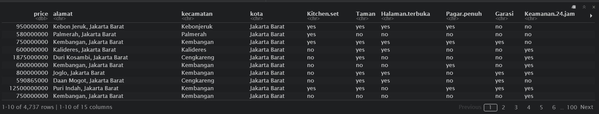
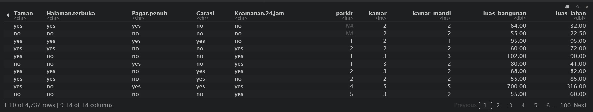
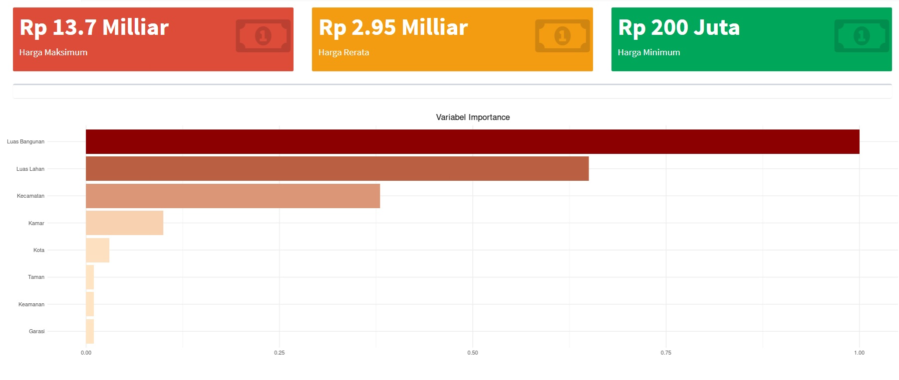
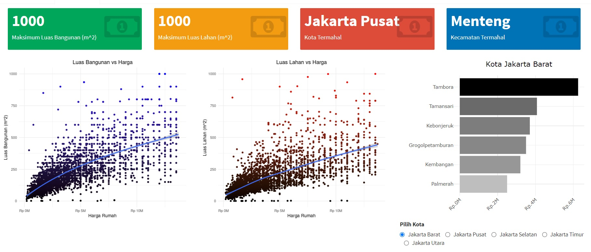

## House Price Prediction in Jakarta by Reza Lutfi Ismail 

# Introduction
Seperti yang kita ketahui bahwa rumah menjadi salah satu aset yang diidam-idamkan oleh semua orang. selain dapat digunakan sebagai tempat tinggal, kita juga dapat menjadikan rumah sebagai instrument investasi yang menguntungkan, karena harganya yang cenderung naik dari tahun ketahun. namun yang menjadi kendala bagi sebagian orang adalah harganya yang tidak terjangkau. dari permasalahan tersebut, saya membuat sebuah project berisikan dashboard mengenai prediksi harga rumah di jakarta. dimana, dashboard tersebut dapat memberikan informasi mengenai variabel apa saja yang mempengaruhi harga dan dapat memberikan insight dalam penentuan harga rumah dengan spesifikasi dan lokasi tertentu, berdasarkan data pada website property yaitu lamudi.com 

Data yang saya ambil adalah data hasil Extract, Transform dan Load (web scraping) yang saya lakukan pada website lamudi.com. karena seperti yang kita ketahui, untuk mendapatkan data yang kita inginkan di Indonesia sangatlah sulit

# Dependencies
Menggunakan software R Studio dan package seperti: 

- rvest (web scraping HTML)
- Leaflet (Plot Map)
- Plotly (Interactive Plot)
- randomForest (Modeling with Random Forest Algorithm)
- tidyverse (data wrangling)

# ETL (Extract, Transform dan Load)

## Extract

melakukan extracting pada website lamudi.com dengan menggunakan SelectorGadget pada aplikasi Chrome, lalu node pada HTML tersebut dimasukan kedalam script R untuk melakukan exracting menggunakan package Rvest.  

## Transform & Load

melakukan trnsformasi pada data yang sudah di extract (raw data) menjadi data yang lebih bersih dan siap disajikan (Load) 

# EDA 
sebelum melakukan modeling pada data, alangkah baiknya jika kita mengenal atau mengeksplor data yang kita miliki. dimana hasil dari EDA tersebut adalah sebagai berikut: 

# Modeling 

pada proses modeling, saya membagi data menjadi dua objek yaitu data training dan data validasi dimana persentase masing-masing adalah 80% dan 20% yang nantinya akan dilakukan cross validation. pada model ini, saya menggunakan algoritma random forest dan didapat MAPE sebesar 24.5%. dimana, output dari model ini adalah Harga dari spesifikasi rumah yang terdapat pada data. 

## Conclusion

Pada project ini, saya telah membuat dashboard tentang prediksi harga menggunakan tools R Studio dan Algoritma Random Forest dimana rerata persentase error (MAPE) sebesar 24.5%. Untuk mengetahui lebih lanjut mengenai dashboard saya, anda bisa mengunjungi laman pada link berikut: 

https://rezalutfi40.shinyapps.io/DCD_house_price_prediction/

